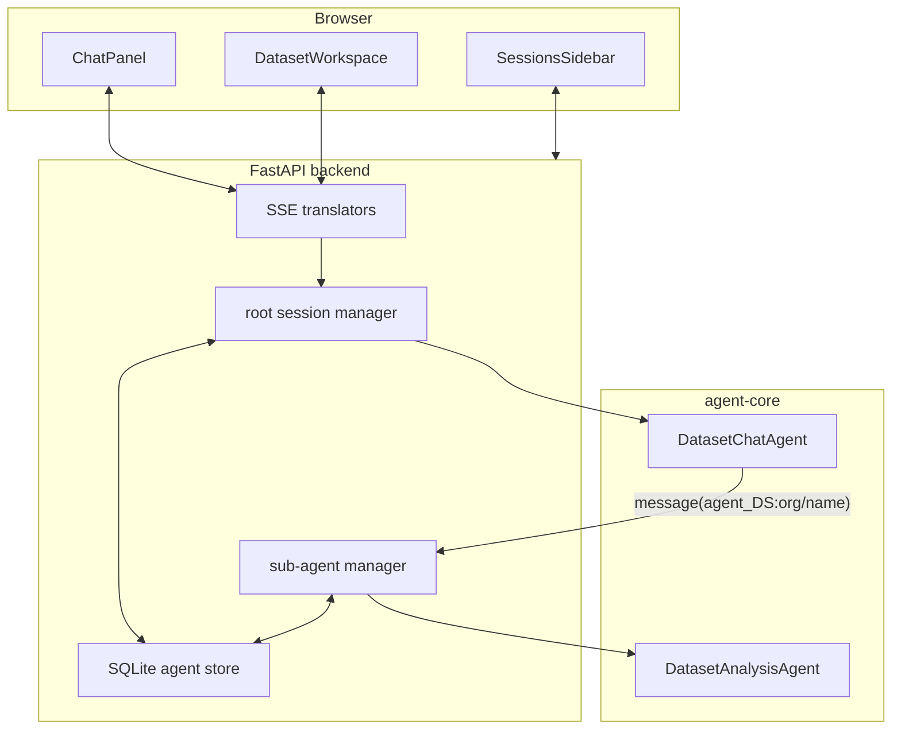
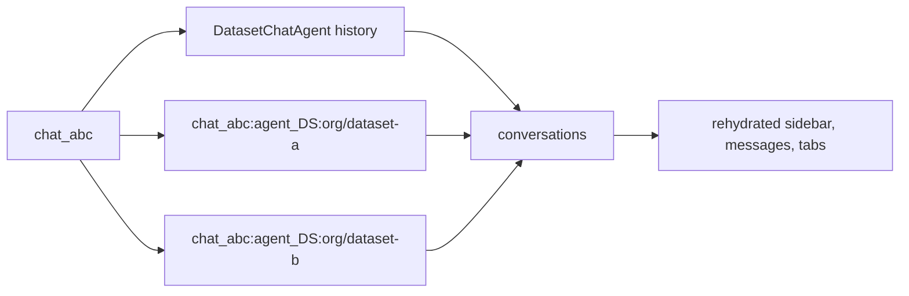

# Architecture

Dataset Finder is a two-agent local app: one root agent searches and recommends, while one persistent specialist agent handles each selected dataset.



## Agent Responsibilities

| Layer | Job | Tool surface |
| --- | --- | --- |
| `DatasetChatAgent` | Talk to the user, search, rank, compare, and delegate deep dives. | Nimble search/extract, HF metadata/card/preview, `message(agent_DS:...)`. |
| `DatasetAnalysisAgent` | Inspect one selected dataset deeply and answer follow-ups in context. | `analyze_hf_dataset`, `query_hf_dataset_with_clickhouse`, `preview_hf_dataset`. |

The root agent never receives raw ClickHouse lifecycle tools. It asks a dataset specialist to do that work.

## Session Model



Durable state lives in `backend/agent_state/agent_sessions.sqlite3`:

- `chat_sessions`: sidebar rows and titles.
- `conversations`: replayable root and specialist histories.
- `agent_runs`: one row per agent run.
- `agent_events`: tool and agent events for observability.
- `conversation_snapshots`: post-turn root history snapshots.

## Live Routing

`backend/server.py` translates `agent_core` events into SSE frames. Each frame carries identity fields:

```json
{
  "agent_id": "runtime instance id",
  "agent_type": "dataset_chat or dataset_analysis",
  "parent_agent": "root instance id when present",
  "agent_session_id": "stable chat or dataset-agent session id"
}
```

The frontend routes `dataset_chat` frames to the main thread and `dataset_analysis` frames to the matching dataset tab.

## Concurrency

- Root turns are serialized by chat session in `session_manager.py`.
- Dataset specialist turns are serialized by sub-agent id in `sub_agent_manager.py`.
- Work against the same Hugging Face repo is serialized by normalized dataset id.
- Root agent parallel tool budget: `MAX_PARALLEL_TOOLS = 10`.
- Specialist parallel tool budget: `MAX_PARALLEL_TOOLS = 5`.
- `nimble_extract_url` also batches up to 20 URLs and extracts up to 10 in parallel internally.

## Key Files

| Area | Files |
| --- | --- |
| Backend app | `backend/server.py`, `backend/main.py` |
| Root agent | `backend/agent.py` |
| Dataset specialist | `backend/agents/dataset_analysis.py` |
| Session state | `backend/agents/persistence.py`, `session_manager.py`, `sub_agent_manager.py` |
| Tools | `backend/tools/*.py` |
| ClickHouse internals | `backend/clickhouse/*.py` |
| UI shell | `frontend/src/App.jsx` |
| UI streaming state | `frontend/src/hooks/useAgentChat.js` |
| Dataset chips | `frontend/src/components/MarkdownContent.jsx` |

