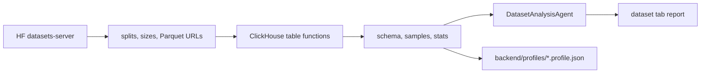
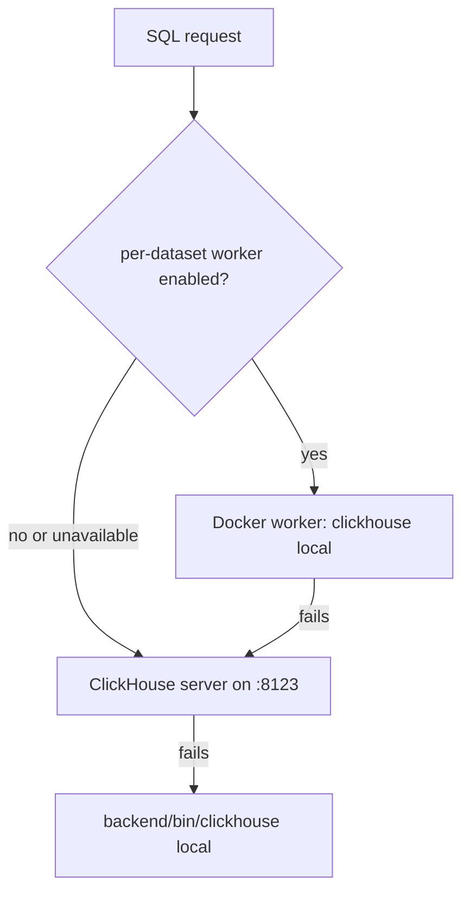
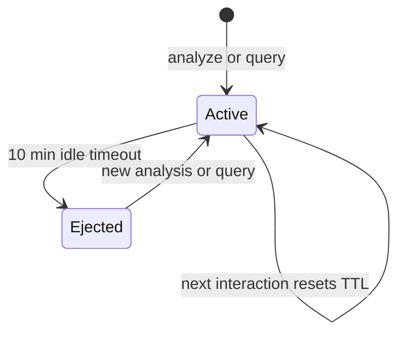

# ClickHouse

ClickHouse is the scaling layer for selected datasets. It lets a specialist agent inspect Hugging Face Parquet with SQL without downloading the whole dataset into the app.



## Why It Matters

Search can find candidate repos. ClickHouse answers whether a selected dataset is actually useful:

- What configs and splits exist?
- How many rows and columns are available?
- What is the schema?
- Which columns look like labels, prompts, images, paths, or conversations?
- Are there nulls, empty strings, skewed labels, duplicates, or suspicious values?
- Can a targeted SQL check answer a user-specific concern?

## Runtime Modes

`ClickHouseRunner` tries these in order:



| Mode | Best for | Notes |
| --- | --- | --- |
| Worker | Isolated per-dataset work. | Deterministic container name, shared cache/profile mounts, 10-minute idle TTL. |
| Server | Persistent local development. | Start with `cd backend && docker compose up -d clickhouse`. |
| Local binary | No server needed. | Install `backend/bin/clickhouse`; enough for remote Parquet profiling. |

## Agent-Facing Tools

| Tool | Used by | Purpose |
| --- | --- | --- |
| `analyze_hf_dataset` | Dataset specialist | Broad profile: structure, schema, samples, column roles, stats, artifact path. |
| `query_hf_dataset_with_clickhouse` | Dataset specialist | One constrained read-only SQL query after analysis. |
| `preview_hf_dataset` | Root and specialist | Cheap row examples from HF datasets-server. |

Lifecycle helpers such as worker start, status, and eject are internal backend controls, not normal root-agent tools.

## Safety Policy

`analyze_hf_dataset(..., depth="auto")` full-profiles only small selected splits:

- max full-scan bytes: `100_000_000`
- max full-scan rows: `100_000`

Large or unknown splits use sample profiling unless the user explicitly asks for full depth.

`query_hf_dataset_with_clickhouse` guardrails:

- SQL must be `SELECT` or `WITH`.
- SQL must query `{table}`.
- Semicolons, write statements, and direct table functions are rejected.
- Returned rows are capped at `LIMIT <= 100`.
- Large splits require `allow_large=True`.

## Lifecycle



Session files live in `backend/dataset_sessions/`. Profile artifacts live in `backend/profiles/`.

## Useful Commands

```bash
cd backend && docker compose up -d clickhouse
curl http://localhost:8123/ping

.venv/bin/python -m backend.clickhouse.profile_hf_dataset TuringEnterprises/Open-MM-RL
.venv/bin/python -m backend.clickhouse.profile_hf_dataset sensenova/SenseNova-SI-8M --mode sample
```

Install the local binary fallback:

```bash
mkdir -p backend/bin
cd backend/bin
curl https://clickhouse.com/ | sh
```
