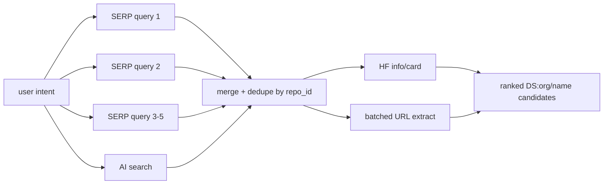

# Nimble

Nimble is the live discovery layer. It keeps the agent grounded in current web and Hugging Face pages instead of stale model memory.



## Role In The System

Nimble does two jobs:

1. Discovery: find real Hugging Face dataset repos for the user's open-ended need.
2. Uniformization: extract rendered dataset pages into comparable markdown cards.

The root agent is prompted to call 3-5 `nimble_serp_search_hf` searches in parallel with varied keywords and one `nimble_ai_search_hf` call for semantic recall.

## Tool Surface

| Tool | Use | Output |
| --- | --- | --- |
| `nimble_serp_search_hf` | Google SERP filtered to HF datasets. | `{repo_id, url, title, snippet, position}` |
| `nimble_ai_search_hf` | Semantic web search biased to HF datasets. | Same shape as SERP hits. |
| `nimble_extract_url` | Render and extract one batch of URLs as markdown. | One success/error result per URL. |
| `nimble_web_search` | External context such as papers, leaderboards, blogs. | `{title, url, snippet}` |

## Parallelization

- The root agent can run up to 10 tools in parallel.
- The prompt asks for 3-5 SERP searches plus one AI search at the same time.
- `nimble_extract_url` accepts up to 20 URLs and extracts up to 10 concurrently.
- Extraction failures are per URL, so one blocked page does not fail the batch.

## Why SERP Plus AI Search

SERP is strong for exact keywords: benchmark names, modalities, tasks, and domain terms. AI search is better for intent: "small verifiable multimodal STEM benchmark" or "instruction data with image-grounded answers."

Candidates that appear in both streams are stronger signals.

## Query Pattern

For "multimodal STEM benchmark with images and verifiable answers", the root agent should search variations like:

```text
site:huggingface.co/datasets multimodal STEM benchmark physics math
site:huggingface.co/datasets visual question answering science benchmark
site:huggingface.co/datasets image grounded math physics dataset
site:huggingface.co/datasets verifiable multimodal reasoning dataset
```

Then it should run one AI search:

```text
huggingface.co/datasets multimodal STEM benchmark with images and verifiable answers
```

After merge/dedupe, it should call `nimble_extract_url` once with the shortlisted HF URLs.

## User-Facing Contract

When the agent names a dataset, it must write `DS:org/name`. The UI only turns that explicit marker into a clickable dataset chip.

