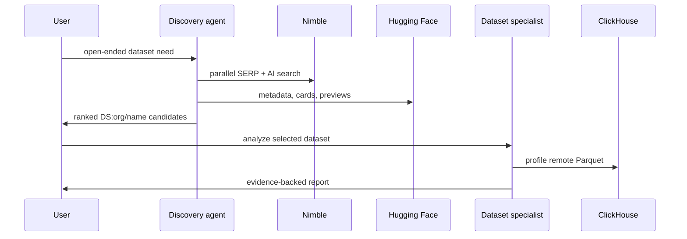

# Vision

Dataset Finder is a local-only research workspace for finding ML datasets and understanding whether they fit a user-specific job.

## Product Goal

Make dataset discovery feel like a focused research conversation:

1. The user describes the dataset they need.
2. The root agent searches the live web and Hugging Face.
3. The agent ranks real dataset repos and explains tradeoffs.
4. The user clicks a dataset to open a dedicated specialist.
5. The specialist inspects real rows and answers follow-up questions in context.

## Engineering Principles

- Ground discovery in live search, not model memory.
- Keep root search separate from dataset-specific analysis.
- Preserve context with persistent chat and specialist sessions.
- Show work as it happens through streamed tool activity.
- Use ClickHouse as a flexible interaction layer over real dataset files.
- Keep everything local: backend, UI, SQLite state, profile artifacts, and optional ClickHouse runtime.

## Current Shape

- Backend: FastAPI, SSE, SQLite, `agent-core`, OpenRouter, Nimble, Hugging Face, ClickHouse.
- Frontend: Vite, React, Tailwind, three-pane chat plus dataset workspace.
- Root model: `deepseek/deepseek-v4-pro` through OpenRouter.
- Dataset specialists: one stable agent per `(chat session, repo_id)`.

